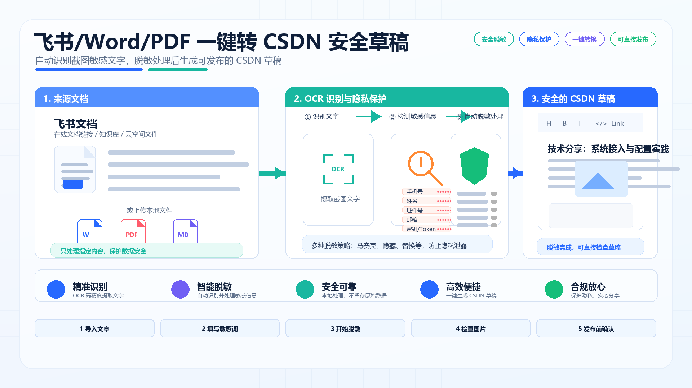
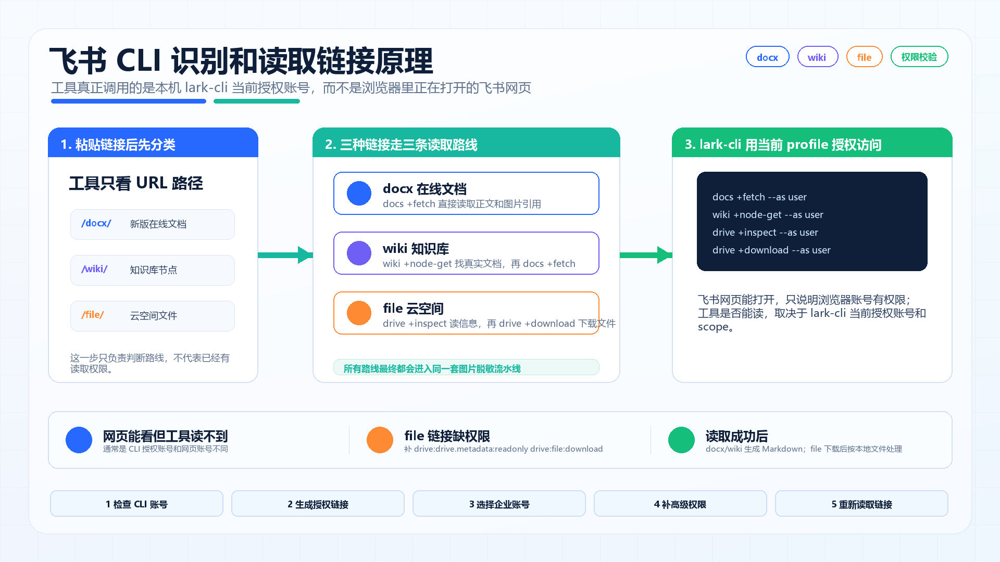
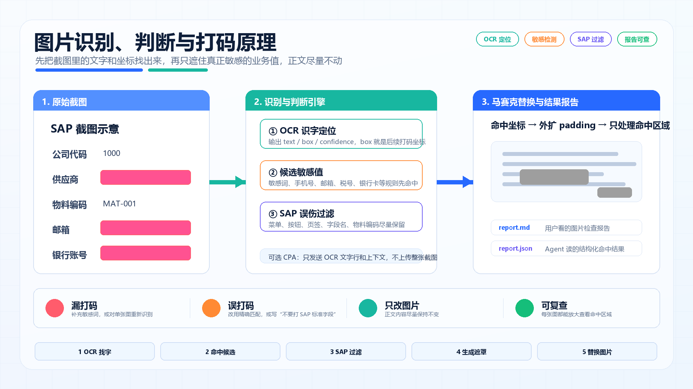
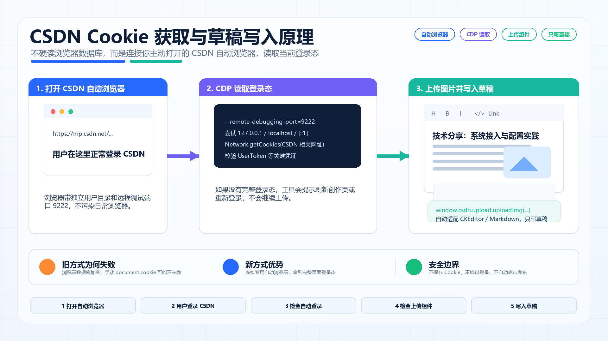

# Auto Image Redactor

本项目是一个本地运行的图片脱敏与 CSDN 草稿助手，主要用于把飞书 SOP、Word、PDF、Markdown、HTML 或图片中的截图批量打码，并生成可以安全发布到 CSDN 的文章。

核心原则：**文章内容尽量不改，只处理图片里的敏感信息；工具只写入 CSDN 草稿，不会替你点击最终发布。**

## 最新能力

- 支持飞书 `docx`、`wiki` 在线文档链接。
- 支持飞书 `file` 云空间文件链接，会先下载到本地任务目录再处理。
- 支持上传 Word、PDF、Markdown、HTML、图片等本地文件。
- 自动提取文章图片，OCR 识别截图文字并进行马赛克打码。
- 可识别公司、供应商、客户、账号、手机号、邮箱、税号、银行账号等敏感内容。
- 对 SAP 截图做保守判断，尽量避免误打码标准菜单、按钮、页签和固定字段名。
- 支持单张图片重新识别，可基于原图或当前打码图再次处理。
- 支持 CPA OpenAI-compatible API 做行业提示词增强判断。
- 支持打开 CSDN 自动浏览器，自动读取登录态、上传脱敏图片，并写入 CSDN 编辑器。
- 生成安全文章、图片检查报告、结构化报告和可下载压缩包。

## 快速开始

安装依赖：

```bash
python -m pip install -r requirements.txt
```

启动网页工具：

```bash
python auto_image_redactor_cli.py serve
```

然后打开：

```text
http://127.0.0.1:8866
```

Windows 用户也可以直接双击：

```text
start-web-tool.bat
```

## 推荐使用流程

1. 在网页工具中选择来源：飞书链接或本地文件。
2. 填写额外敏感词，例如公司名、供应商名、客户名。
3. 点击“读取并脱敏”或“上传并脱敏”。
4. 在右侧逐张检查图片打码效果。
5. 如果某张图识别不准，使用“重新识别本图”单独修正。
6. 点击“打开 CSDN 自动浏览器”，在新窗口登录 CSDN。
7. 回到工具点击“检查自动登录”和“检查上传组件”。
8. 点击“复制文章并打开 CSDN”，工具会上传图片并写入 CSDN 编辑器。
9. 最终发布前，由用户在 CSDN 页面人工检查并确认。

## 核心实现原理图

下面 4 张图把工具最核心的原理讲清楚：飞书怎么读、图片怎么识别打码、CSDN 登录态怎么拿、整个工具怎么串起来。

### 1. 工具整体实现原理



一句话理解：工具把文章、图片、登录态都留在本机处理，只把确认后的安全草稿写入 CSDN。

### 2. 飞书 CLI 识别和读取链接原理



一句话理解：网页飞书账号不等于 `lark-cli` 当前授权账号；工具真正调用的是本机 CLI，再按 `docx/wiki/file` 类型走不同读取路径。

### 3. 图片识别和打码原理



一句话理解：先用 OCR 找出图片里的文字和坐标，再通过敏感词、规则、SAP 过滤判断哪些区域需要打码，最后只替换图片里的命中区域。

### 4. CSDN Cookie 获取与草稿写入原理



一句话理解：工具不是去硬读浏览器数据库，而是连接你主动打开的 CSDN 自动浏览器，通过 Chrome 调试协议读取当前登录态，再调用 CSDN 页面上传组件写入草稿。

## 飞书链接说明

本工具通过本机 `lark-cli` 读取飞书内容，所以飞书网页里切换账号，不等于 CLI 已经切换账号。网页工具右上角“设置 → 飞书账号”里可以检查当前 CLI 账号并重新授权。

支持的飞书链接：

| 链接类型 | 处理方式 | 说明 |
|---|---|---|
| `docx` | 直接读取文档正文 | 适合飞书新版文档 |
| `wiki` | 先解析知识库节点，再读取正文 | 当前账号必须有权限 |
| `file` | 先从云空间下载文件，再按本地文件处理 | 需要 Drive 下载权限 |

如果 `file` 云空间文件提示缺权限，请在“设置 → 飞书账号 → 高级权限编号”填入：

```text
drive:drive.metadata:readonly drive:file:download
```

然后重新生成企业账号授权链接并完成授权。

## CSDN 草稿写入说明

当前推荐使用“CSDN 自动登录浏览器”：

1. 点击“打开 CSDN 自动浏览器”。
2. 在新打开的浏览器窗口里登录 CSDN。
3. 确认页面停留在 CSDN 创作编辑页。
4. 回到工具点击“检查自动登录”。
5. 再点击“检查上传组件”。
6. 文章处理完成后，点击“复制文章并打开 CSDN”。

工具会通过 CSDN 页面自己的上传组件上传脱敏图片，再把文章标题和正文写入编辑器。这样不会依赖个人图床，也不会把本地图片地址直接塞进 CSDN。

安全边界：

- 不会把 CSDN Cookie 写入仓库。
- 不会自动点击“发布”。
- 不会绕过 CSDN 登录；必须由用户在自动浏览器里正常登录。

常见提示：

| 提示 | 处理方式 |
|---|---|
| 没有找到已打开的 CSDN 自动浏览器 | 重新点击“打开 CSDN 自动浏览器”，确认新窗口没有被关闭 |
| 没有读到完整登录态 | 在自动浏览器里重新登录 CSDN，并刷新创作页 |
| 上传组件还没加载 | 让自动浏览器停留在创作编辑页，刷新后再检查 |
| 编辑器写入失败 | 确认自动浏览器打开的是 CSDN 创作页，而不是旧版空白编辑页 |

## CLI 用法

检查环境：

```bash
python auto_image_redactor_cli.py health
```

处理本地文件：

```bash
python auto_image_redactor_cli.py process article.docx --terms "某某公司,某某供应商" --jsonl
```

处理多个本地文件：

```bash
python auto_image_redactor_cli.py process article.md image1.png image2.png --terms "某某公司"
```

处理飞书链接：

```bash
python auto_image_redactor_cli.py lark "https://example.feishu.cn/docx/..." --terms "某某公司,某某客户" --jsonl
```

启用 CPA 大模型辅助判断：

```bash
python auto_image_redactor_cli.py process article.docx --use-cpa --api-key "sk-xxxx" --model "gpt-5.5"
```

使用行业提示词文件：

```bash
python auto_image_redactor_cli.py process article.docx --use-cpa --industry-prompt-file prompts/sap.txt
```

单张图片重新识别：

```bash
python auto_image_redactor_cli.py rerun-image <job_id> 2 --image-source original --instruction "只打码真实供应商名称，不要打码 SAP 标准字段"
```

`--image-source` 可选：

| 值 | 含义 |
|---|---|
| `original` | 基于文档原图重新识别 |
| `masked` | 基于当前打码图重新识别 |

CLI 默认输出 JSON；加 `--jsonl` 后会输出逐步进度，方便 Agent 实时监听。

## 输出结果

每次处理都会在本地 `runs/<job_id>/` 下生成结果：

| 文件 | 用途 |
|---|---|
| 安全文章 | 已替换为脱敏图片的文章 |
| `report.md` | 图片检查报告 |
| `report.json` | 结构化检查结果 |
| 压缩包 | 方便转移或备份的完整结果 |

这些运行结果默认不会上传到 GitHub。

## 脱敏词库

仓库只提供安全示例：

```text
sensitive_terms.example.txt
```

本地使用时可复制为：

```text
sensitive_terms.txt
```

`sensitive_terms.txt` 已被 `.gitignore` 忽略，避免把真实公司、供应商、客户等敏感词误传到公开仓库。

## CPA API 配置

工具使用 OpenAI-compatible 接口，默认 Base URL：

```text
https://cpa.fengsha.online/v1
```

网页端可以在右上角“设置”中测试连接、获取模型并选择模型。

CLI 可传：

```bash
--use-cpa --api-key "sk-xxxx" --base-url "https://cpa.fengsha.online/v1" --model "gpt-5.5"
```

## 不会上传到 GitHub 的内容

`.gitignore` 默认排除：

- 本地运行结果：`runs/`
- 临时输出：`output/`
- 测试结果：`test-results/`
- 日志：`*.log`
- 本地缓存：`.uv-cache/`、`.npm-cache/`、`.playwright-cli/`
- 私有行业提示词：`industry_prompts/`
- 真实脱敏词库：`sensitive_terms.txt`
- 本地 Word、PDF、Excel、PPT 样例文件

## 给 Agent 的说明

Agent 自动化前请先阅读：

```text
LLM.TXT
```

里面包含 CLI 命令、输出字段、隐私边界和推荐操作流程。
